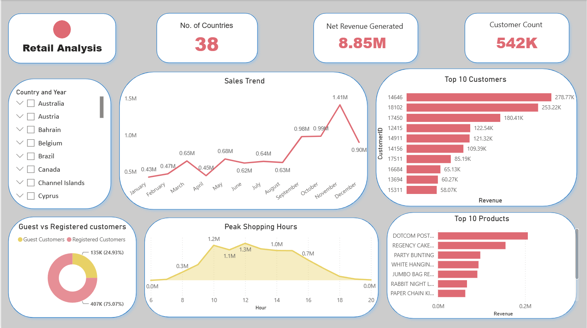

# Retail Performance Dashboard

A Power BI project by **Akshat Kaushik** for exploring retail sales, customer activity and purchasing patterns. The dashboard combines high-level summaries with monthly trends, customer and product rankings, and shopping-hour analysis.



*The screenshot shows an earlier appearance. The included Power BI report already contains the soft gradient background.*

The supplied workbook contains **541,909 retail line items**, **25,900 distinct invoice identifiers**, and **38 countries**. There are **4,372 distinct customer IDs** when the shared `Guest` label is excluded. Invoice timestamps cover **1 December 2010 to 9 December 2011**.

## What the dashboard covers

- **Overview:** country coverage, net revenue and the customer count measure.
- **Sales trends:** monthly revenue patterns and seasonal changes.
- **Customer analysis:** the top 10 customers by revenue and a guest-versus-registered breakdown.
- **Product analysis:** the top 10 products by revenue.
- **Shopping patterns:** activity across different hours of the day.
- **Filters:** country and year selection for exploring the report.

## Report pages

| Page | Contents |
| --- | --- |
| **Home** | The main retail dashboard shown above. |
| **page2** | A country-level comparison of total quantity and revenue. |
| **Map** | A geographic view of quantity by country. |

## Tools and work involved

The project uses **Power BI, DAX and Excel**, with data cleaning and modelling to prepare retail records for analysis. The report brings the results together through KPI cards, line and bar charts, a donut chart, and an area chart.

## Repository contents

```text
retail-performance-dashboard/
|-- assets/
|   |-- dashboard-preview.png
|   `-- dashboard-background.png
|-- data/
|   `-- Online Retail.xlsx
|-- docs/
|   `-- data-notes.md
|-- report/
|   `-- Online_Retail_Dashboard.pbix
|-- .gitattributes
|-- .gitignore
`-- README.md
```

## Open the dashboard

1. Download this repository as a ZIP and extract it, or clone it with Git.
2. Open [`report/Online_Retail_Dashboard.pbix`](report/Online_Retail_Dashboard.pbix) in **Power BI Desktop for Windows**.
3. To refresh the report on your computer, open **File > Options and settings > Data source settings**.
4. Select the Excel source and choose **Change Source**. Browse to the included [`data/Online Retail.xlsx`](data/Online%20Retail.xlsx).
5. Apply the change and select **Refresh**. If the source is not editable in that dialog, open **Transform data**, select the retail query, and update its **Source** step to the same workbook.
6. Use the report tabs and country/year slicer to explore the dashboard.

GitHub displays the screenshot and documentation. Open the `.pbix` file in Power BI Desktop to use the interactive report.

## Dashboard background

The included **1920 x 1080 PNG** uses a soft blue-to-lavender gradient with a hint of blush, designed to complement the white cards and coral chart colours.

To apply it in Power BI Desktop:

1. Select a blank area of the report page.
2. Open **Format page > Canvas background** and add `assets/dashboard-background.png`.
3. Set **Transparency** to **0%** and **Image fit** to **Fit**.

The background is also embedded in the supplied report.

## Reading the figures

The screenshot's **542K Customer Count** matches the rounded number of retail line items. It should not be interpreted as 542,000 distinct customers. A customer can appear on several lines and invoices, and `Guest` is a shared label rather than a unique customer identifier.

See [data notes](docs/data-notes.md) for workbook counts, field definitions and interpretation notes. Report measures may use filters or transformations beyond these workbook totals; the source counts are not a recalculation of the embedded DAX measures.
